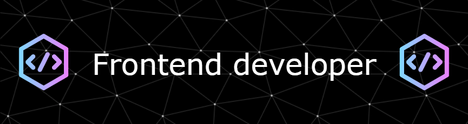

<h1 align="center">Hi 👋, I'm Dhiraj Taye</h1>
<h3 align="center">A passionate frontend developer from India</h3>

  

- 🌱 Recent graduate with a Bachelor's degree in Computer Science.

- 👨‍💻 Enthusiastic about exploring and analyzing datasets to uncover actionable insights.

- 📫Proficient in data analysis tools such as Excel, SQL, and Python.

- ⚡Eager to learn and grow in the field of data analytics.

<h3 align="left">Connect with me:</h3>

<h3 align="left">Languages and Tools:</h3>

         

